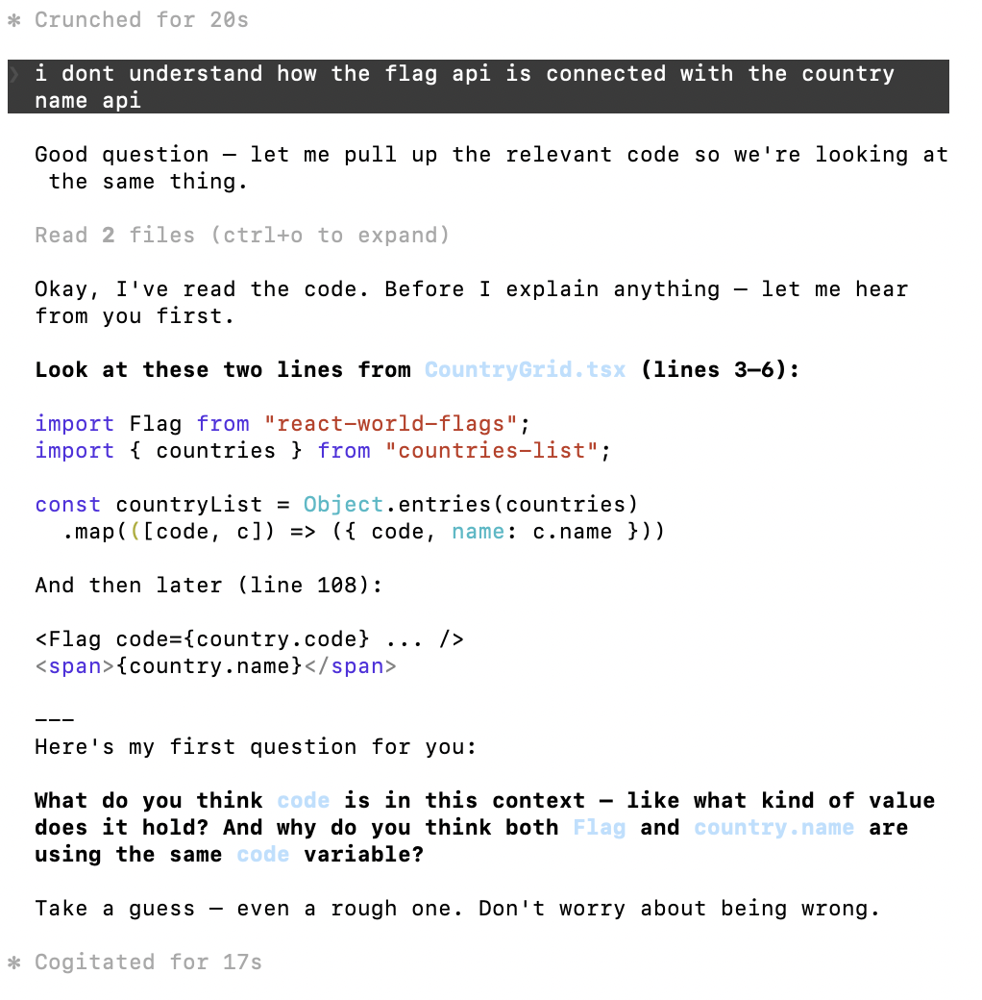
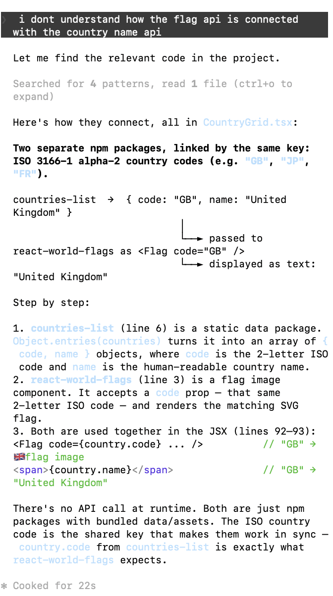

## Motivation

An attempt to untolerate stupidity and foster learning through practing in agentic coding workflows. The approach is inspired by a journal article [Redefining the Software Engineering Profession for AI](https://dl.acm.org/doi/10.1145/3779312)

## Key Features
- Prompt user to come up solution first instead of directly provide solution.
- Detailed instructions on using Socratic dialogue and guided reasoning in coaching.

| With Skill | Without Skill |
|---|---|
|  |  |

### To Be Improved
- User needs to manually trigger the implementation of the skill by prompting or using the `/` command, would it be also nice if the agent jumps out and say let's learn some new stuff? 
- The agent doesn't really follow all the phases in the instruction in order, it only goes through the coaching stage unless the user try to get out of it and ask something else
- The agent does not confirm actively if it saves the memory of the learning history, making human unaware of the shared history
- It says it does not have confluence access but it is in the skill instruction, see [example](./bug-no-confluence.png)
- Overview of the features and examples in readme.md
- sidetrack topics instead of staying in the same problem solvinglin (i mean i can do this but the bot should not)

## Installing the skill in Claude desktop (will also show in claude code):
1. Download the `skill-programming-preceptor` folder
2. Zip the `skill-programming-preceptor` folder
3. Open Claude.ai > Settings > skills
4. Click "Upload skill"
5. Open the zipped file

## Installing the skill in Claude Code:
1. Clone repo: `git clone https://github.com/jollyland24/cf-jolly-programming-perceptor-skill.git`
2. Locate or create `~/.claude/skills/` directory on your machine
3. Duplicate the skill to the skill directory: `cp -r  /Users/[user-name]/Documents/GitHub/cf-jolly-programming-perceptor-skill ~/.claude/skills/`
4. Verify in Claude Code with `/skills`

> **Note:** Installing methods could change with the constant product updates from Anthropic, this instruction is based on experience and this [document](https://resources.anthropic.com/hubfs/The-Complete-Guide-to-Building-Skill-for-Claude.pdf) if you hit issues, ask claude what is the applicable way of installing.

